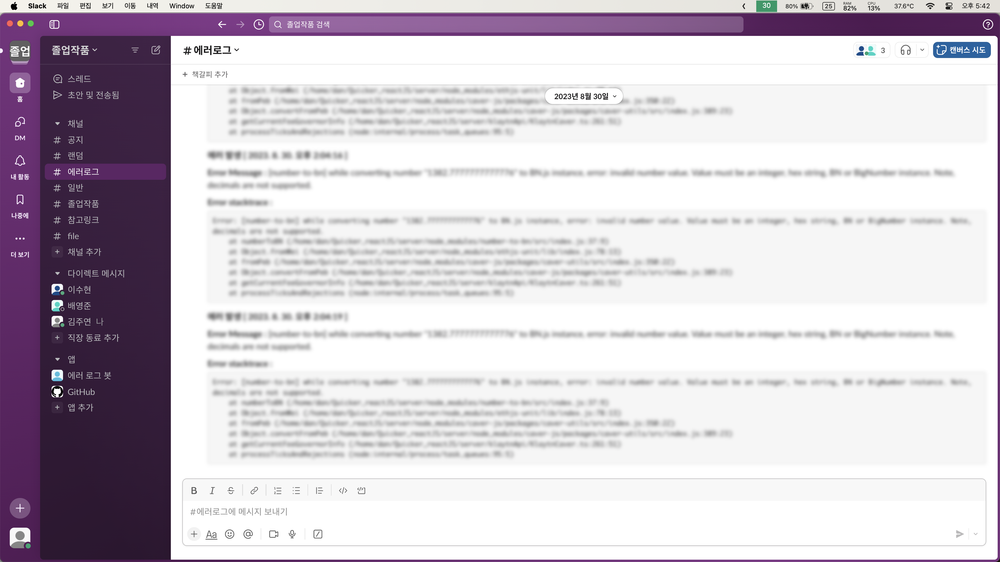

# Quicker <!-- omit in toc -->

블록체인 기반 퀵, 배달 중개 플랫폼

Quicker는 스마트컨트랙(Smart contract)으로 의뢰인과 배송원 사이의 계약을 자동화 하여 금융기관의 매개없이 결제와 배송이 이뤄지고 투표를 통해 권력을 분산한 Web3 플랫폼입니다.

## 관련 기술

- **Front:** React, TypeScript, Kotlin(Android), Zustand, TMapAPI
- **Back:** Node.js, TypeScript, Express.js, Sequlize, Mongoose, SlackAPI, Naver SMS API
- **Blockchain:** Solidity, Klaytn
- **DB:** MariaDB, MongoDB
- **Compute:** AWS EC2, GCP Compute Engine, CloudType
- **Network:** Cloudflare
- **Tool:** Git, Slack, Figma, ERDCloud

## 담당

- 배영준: 프론트
- 이수현: 백(블록체인), 프론트(Sub)
- 김주연: 백(Main), 프론트(Sub)

## 시스템 구조

### 거래 프로세스<!-- omit in toc -->

### 시스템 아키텍처<!-- omit in toc -->

### 스마트컨트랙<!-- omit in toc -->

### 데이터베이스 ERD<!-- omit in toc -->

## 시연

### 시연 영상 링크<!-- omit in toc -->

- [유튜브](https://www.youtube.com/@Quicker-Youtube/featured)

### 로그인<!-- omit in toc -->

### 의뢰 생성<!-- omit in toc -->

### 의뢰 수락<!-- omit in toc -->

#### 수취인에게 메세지 발송<!-- omit in toc -->

### 의뢰인과 배송원 사이 채팅<!-- omit in toc -->

### 배송원 실시간 위치 추적<!-- omit in toc -->

### 배송 완료<!-- omit in toc -->

- QR코드, [사진 전송](https://youtu.be/RDm0j8RfQWQ?feature=shared&t=480)을 통한 배송완료가 가능

### 정산<!-- omit in toc -->

### 서버 장애 알림 봇<!-- omit in toc -->

## 추가 기능 및 변경 사항(v2) <!-- omit in toc -->

- 블록체인 네트워크 변경(Polygon -> Klaytn)
- 암호화폐 지갑 연결 방식 변경
- 블록체인 가스비 대납
- 배송컨트랙 프록시 구조 적용
- 토큰 스테이킹
- 거래 수수료 투표
- 프로필 NFT 적용

## 보완 사항 <!-- omit in toc -->

- 배포 자동화
