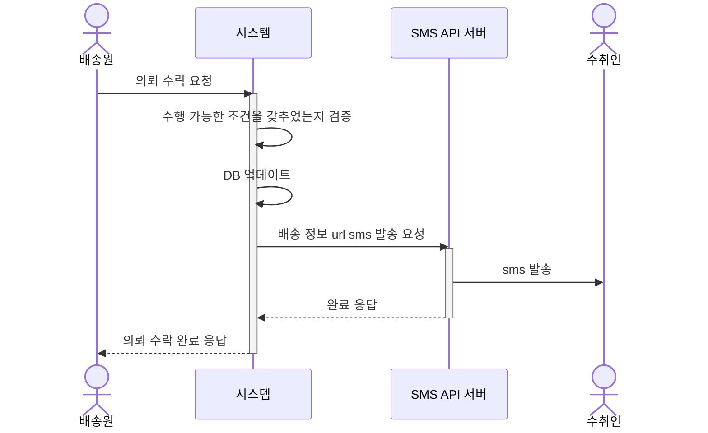
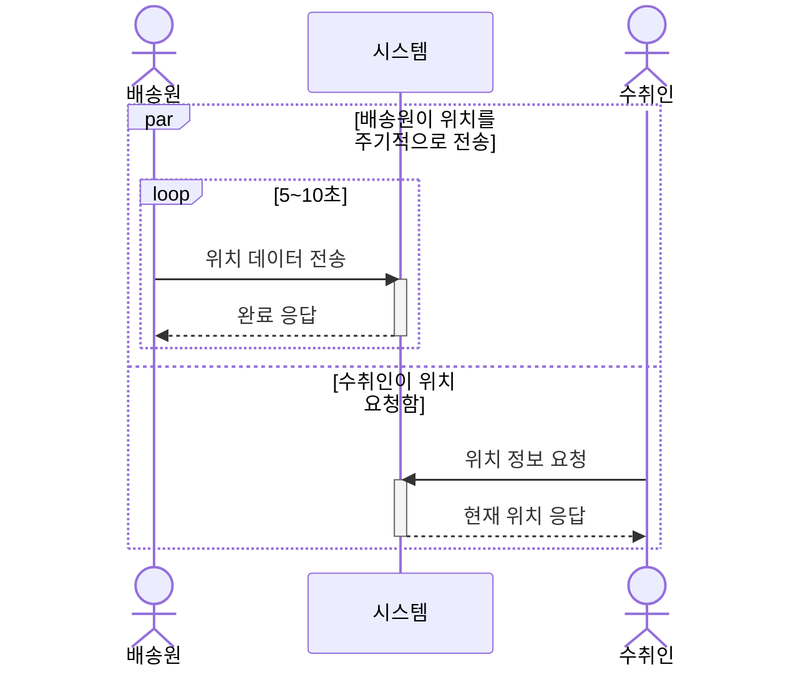
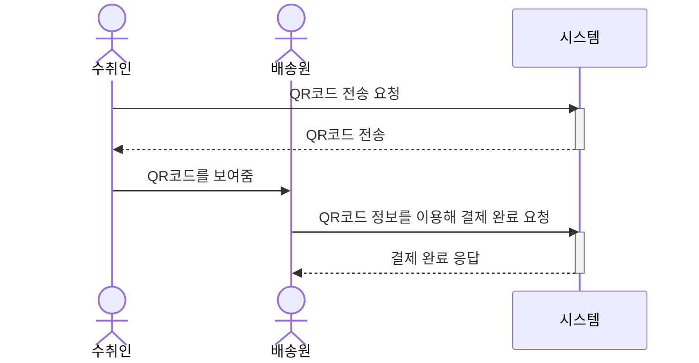
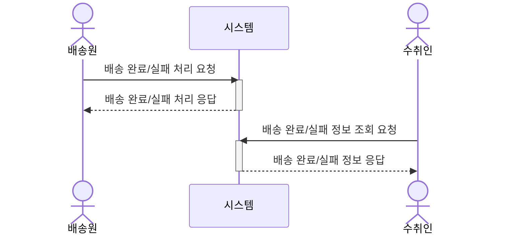

### 문제

퀵 서비스에서 배송원이 의뢰를 수락하면 수취인은 배송원의 위치 조회, 배송 완료와 실패 여부 확인, 대면 배송 처리를 할 수 있어야 합니다. 다음은 필요한 기능들 입니다.

- 배송원이 의뢰를 수락하면 서비스가 수취인에게 배송 정보 URL을 전송해야 함
- 배송원과 수취인이 직접 대면해 거래해야함
- 대면 배송이 불가능한 경우가 있어 비대면으로 배송완료, 실패를 처리해야 함
- 배송원의 위치를 지속적으로 조회할 수 있어야 함

아래는 유스케이스입니다.

어떻게 설계했는지 작성하겠습니다.

### 배송원의 의뢰 수락 후 sms로 수취인에게 배송 정보를 전송

배송원이 의뢰를 수락하면 서비스가 수취인에게 배송원 위치 조회, 대면 배송 처리를 위한 QR 코드, 배송 결과를 제공해야합니다.

다이어그램

시연

[접속 URL 문자 발송](https://github.com/user-attachments/assets/c77f2e0e-df44-4aee-b45c-1118bd8c47ec)

### 배송원 위치 조회

#### 문제

퀵 서비스 특성상 중요하고 빨리 받아야하는 물품을 맡기다보니 수취인은 배송원이 어디까지 왔는지 궁금합니다.

#### 해결

택배 배송 시스템(CJ대한통운)은 인터넷으로 현재 물품의 위치, 배송 현황, 예상 경로등을 제공합니다. 이 아이디어를 프로젝트에 적용해 배송원이 의뢰를 수락하면 주기적으로 위치를 기록하고 그 위치와 도착지 정보를 이용해 예상 경로를 제공합니다.

다이어그램

시연

[배송원 위치 조회](https://github.com/user-attachments/assets/3fdd8274-9d69-48ae-beec-14629b16c9cb)

### QR코드로 배송완료

#### 문제

퀵 서비스에 맡기는 물품은 급하고 중요한 물건일 확률이 높아 대면으로 물품을 전달합니다. 그래서 서비스에서 대면 거래를 주요 방식으로 설계했습니다.

#### 해결

대면 거래에서 간편한 인증 방법을 고민했고 다른 서비스에서 QR코드를 활용하는 걸 프로젝트에 적용했습니다. 수취인은 QR코드를 조회하고 배송원은 QR코드를 스캔해 배송 완료 처리를 할 수 있도록 했습니다.

시연

[QR코드 인증](https://github.com/user-attachments/assets/a209e2c2-4f9a-4c19-bb69-af7f10539b13)

### 배송 결과 확인

#### 문제

서비스에서 대면 거래를 주 흐름으로 설계했지만, 수취인이 부재중인 경우도 있어서 비대면으로 배송 완료하는 기능이 필요했습니다.

#### 해결

배송원은 배송 완료, 실패 사진을 업로드하면 수취인이 확인할 수 있습니다.

시연

https://github.com/user-attachments/assets/7cede987-0ede-4c9d-a797-d40fc405730a

https://github.com/user-attachments/assets/6b2d209e-c674-4777-a9ca-153de5c0a3c5
